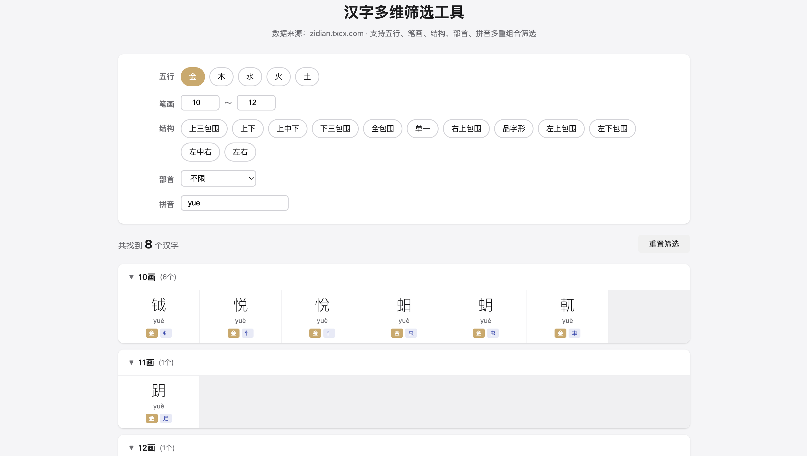

# 汉字多维筛选工具 (NameTool)

一个支持多维度筛选的汉字查询工具，数据来源于 [zidian.txcx.com](https://zidian.txcx.com/)。适用于起名、书法选字等场景。

Online Demo: https://tool-of-lvxiaoxin.eastasia.cloudapp.azure.com/name-tool

## 预览



## 功能特性

- **五行筛选** — 金、木、水、火、土
- **笔画范围** — 自定义最小/最大笔画数
- **部首筛选** — 284 个部首下拉选择
- **结构筛选** — 12 种汉字结构（左右、上下、包围等）
- **拼音搜索** — 支持带调/不带调拼音模糊匹配
- **分组展示** — 查询结果按笔画数分组，点击汉字跳转详情页

## 数据规模

| 维度   | 覆盖率 |
| ------ | ------ |
| 总字数 | 14,387 |
| 五行   | 100%   |
| 部首   | 77.8%  |
| 结构   | 29.1%  |

## 快速开始

```bash
# 安装依赖
npm install

# 启动本地服务
npm run serve
```

浏览器打开 http://localhost:8080 即可使用。

## 部署到服务器

项目包含自动化部署脚本，可一键部署到 Azure VM（Nginx 静态托管）：

```bash
./deploy.sh
```

脚本会自动检查并安装 Nginx、配置 `/name-tool` 路径、启用 gzip 压缩、同步文件。

站点已配置 HTTPS（Let's Encrypt 证书，自动续期）。

在线访问：https://tool-of-lvxiaoxin.eastasia.cloudapp.azure.com/name-tool

## 重新爬取数据

如需更新汉字数据：

```bash
npm run crawl
```

爬取耗时约 3 分钟，结果保存至 `data/characters.json`。

## 项目结构

```
├── index.html              # 前端页面（含全部 CSS/JS）
├── crawl.js                # 数据爬虫脚本
├── deploy.sh               # 自动化部署脚本（Azure VM）
├── data/
│   └── characters.json     # 爬取的汉字数据（14,387 条）
├── demo.png                # 预览截图
├── package.json
├── CLAUDE.md               # AI 上下文文件
└── README.md
```

## License

MIT
